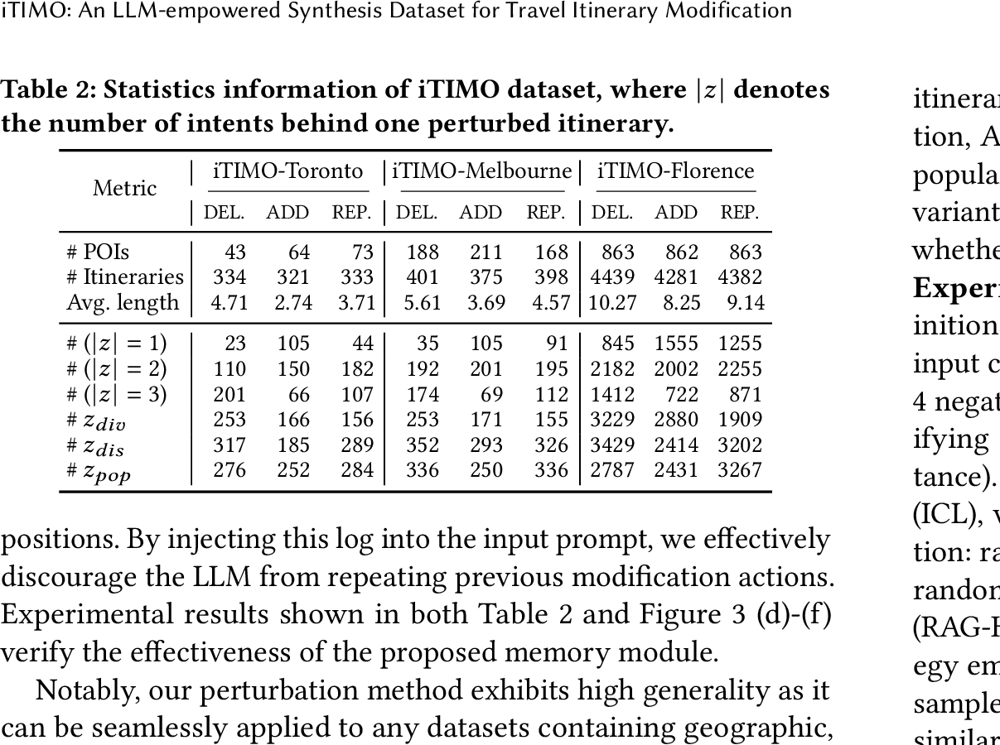

<p align="center">
  
</p>

# 🍄 iTIMO: An LLM-Empowered Synthesis Dataset for Travel Itinerary Modification

This repository provides the dataset and code for *iTIMO: An LLM-Empowered Synthesis Dataset for Travel Itinerary Modification*.

## 📦 Dataset

The released benchmark dataset is under `benchmark/iTIMO_dataset/`:
- `benchmark/iTIMO_dataset/iTIMO-Florence/`
- `benchmark/iTIMO_dataset/iTIMO-Melbourne/`
- `benchmark/iTIMO_dataset/iTIMO-Toronto/`

### 🔁 Perturbation vs. Modification (Important)

In filenames like `benchmark/iTIMO_dataset/iTIMO-Florence/Florence_ADD_test.json`, the `ADD/DELETE/REPLACE` token refers to the **perturbation** operation used to create the need-to-modify itinerary. The **modification** operation is the *inverse*:
- `*_ADD_*.json` → modify with **DELETE** (gold label field: `removed_index`)
- `*_DELETE_*.json` → modify with **ADD** (gold label fields: `insert_index`, `selected_poi`, `selected_cand_id`)
- `*_REPLACE_*.json` → modify with **REPLACE** (gold label fields: `replaced_index`, `selected_poi`, `selected_cand_id`)

### 🧾 File Naming and Format

- Naming: `<City>_<PerturbOp>_<split>.json` (e.g., `Florence_ADD_test.json`)
- Each file is a JSON dict: `{ "<sid>": sample, ... }`
- `sample["example_input"]` includes:
  - `need_to_modify itinerary`: `[[name, category, lon, lat, popularity], ...]`
  - `hint`: natural-language constraints for axes (popularity / category / spatial)
  - `threshold_low`, `threshold_high`: spatial thresholds (km)
  - `Candidate POIs`: present in `*_DELETE_*.json` and `*_REPLACE_*.json` (needed for ADD/REPLACE modification); typically absent in `*_ADD_*.json`

### 📊 Dataset Size (#samples)

The dataset statistics are provided in the paper (Table 2):

<p align="center">
  
</p>

## 🧪 Perturbation (Generate Need-to-Modify Itineraries)

Use these scripts to generate perturbed (need-to-modify) itineraries from raw trajectories:
- `Dataset_Pipline/V31FM_perturbation.py`: perturbation generator with tool-calling + optional memory
- `Dataset_Pipline/baseline_perturbation.py`: baseline perturbation generator

Before running, set API keys in `benchmark/api_key/api_key.py` (and/or in the scripts if required).

```bash
python Dataset_Pipline/V31FM_perturbation.py
```

Notes:
- City / operation are currently configured in each script’s `__main__` block.
- Outputs are written under the corresponding data folders (e.g., `data-cikm16/`, `data-ijcai15/`), depending on the selected city/operation.
- Florence LearNext inputs are read from `data4perturb/Florence/` (Trajectories/PoIs/Categories CSVs).

## 🛠️ Installation

Recommended Python `>=3.10`.

```bash
pip install -r requirements.txt
```

Note: running `Dataset_Pipline/V31FM_perturbation.py` / `Dataset_Pipline/baseline_perturbation.py` / `benchmark/Prompting_LLM.py` requires access to the corresponding APIs (DeepSeek / Azure OpenAI / OpenAI, etc.).

## 📈 Benchmark: Itinerary Modification Evaluation (Different LLMs)

This benchmark evaluates *itinerary modification*: given a need-to-modify itinerary, the LLM must output the **modification operation** (the inverse of the perturbation in the filename).

### 0) Prepare dataset paths (required by the benchmark scripts)

Some benchmark scripts expect files under `benchmark/iTIMO_dataset/<City>_<PerturbOp>_<split>.json`, while the released data is stored under `benchmark/iTIMO_dataset/iTIMO-*/`. Run once:

```bash
cd benchmark
python - <<'PY'
from pathlib import Path

city_dir = {
    "Melb": "iTIMO-Melbourne",
    "Toro": "iTIMO-Toronto",
    "Florence": "iTIMO-Florence",
}
ops = ["ADD", "DELETE", "REPLACE"]
splits = ["train", "val", "test"]

dataset_root = Path("iTIMO_dataset")
for city, sub in city_dir.items():
    for op in ops:
        for sp in splits:
            src = dataset_root / sub / f"{city}_{op}_{sp}.json"
            dst = dataset_root / f"{city}_{op}_{sp}.json"
            if src.exists() and not dst.exists():
                dst.symlink_to(src)

# eval.py also looks for {City}_{Op}_examples.json at benchmark/ root.
for city in city_dir:
    for op in ops:
        src = dataset_root / f"{city}_{op}_test.json"
        dst = Path(f"{city}_{op}_examples.json")
        if src.exists() and not dst.exists():
            dst.symlink_to(src)

print("Symlinks ready.")
PY
```

### 1) Configure API keys / endpoints

- Azure OpenAI: pass `--azure_endpoint` and `--api_key` (or env `AZURE_API_KEY`) to `benchmark/Prompting_LLM.py` with `--provider azure`.
- DeepSeek or other OpenAI-compatible endpoints: pass `--base_url` (e.g., `https://api.deepseek.com/v1`) and `--api_key` (or env `OPENAI_API_KEY`) to `benchmark/Prompting_LLM.py`.
- LM Studio: ensure a local OpenAI-compatible endpoint is running, then call `benchmark/Prompting_LLM.py` with `--base_url http://localhost:1234/v1` and an `--api_key` token.

### 2) Run inference (single-setting runner)

Use the unified runner (per-call single city/op/model/rag/icl). Output goes to `benchmark/prompt_results/`.

```bash
cd benchmark
python Prompting_LLM.py \
  --city Melb --op ADD --split test \
  --provider openai \
  --model "deepseek-chat" \
  --api_key "$DEEPSEEK_KEY" \
  --rag_mode none --icl_num 3 \
  --temperature 0.1 --max_new_tokens 256
```

- For Azure: `--provider azure --model <deployment_name> --azure_endpoint <url> --api_key <key> --azure_api_version 2024-12-01-preview`
- For LM Studio or other OpenAI-compatible endpoints: `--provider openai --base_url http://localhost:1234/v1`
- Default output: `benchmark/prompt_results/prompt_eval_<provider>_<model>_<city>_<op>_rag-<rag>_icl-<icl>_<split>.json`; override with `--output`.

### 3) Parse model outputs to JSON

```bash
cd benchmark
python process_pred.py
```

This writes parsed results to `benchmark/results_parsed/`.

### 4) Compute metrics

```bash
cd benchmark
python eval.py
```

The summary is saved to `benchmark/results_parsed/accuracy_hint_summary.json`.

## 🏋️‍♀️ SFT Fine-tuning Runners (Single Setting per Run)

Both SFT runners load data from `benchmark/iTIMO_dataset/<City>/<City>_<OP>_<split>.json`. You can override base model paths via env (e.g., `ITIMO_FFT_MODEL_QWEN3`, `ITIMO_LORA_MODEL_GEMMA3`).

### Full-parameter FT (Unsloth FFT)

Runs one (city, op) with chosen train/infer RAG + ICL:

```bash
python benchmark/fine_tune_full.py \
  --city Melb \
  --op ADD \
  --model_key qwen3 \
  --train_rag_mode none --train_icl_num 3 \
  --infer_rag_mode none --infer_icl_num 3 \
  --batch_size 8 --max_new_tokens 256
```

Key flags:
- `--city {Melb,Toro,Florence}` and `--op {ADD,DELETE,REPLACE}`
- `--model_key {qwen3,gemma3,llama3}`
- Train setting: `--train_rag_mode`, `--train_icl_num`
- Inference setting: `--infer_rag_mode`, `--infer_icl_num`
- `--batch_size`, `--max_new_tokens`, `--resume/--no-resume`, `--force_rerun`

Outputs: `benchmark/SFT_predictions_fullft/{model}_{city}_{op}_...json`

### LoRA / QLoRA

Runs one (city, op) with chosen train/infer RAG + ICL:

```bash
python benchmark/fine_tune_lora.py \
  --city Melb \
  --op ADD \
  --model_key gemma3 \
  --train_rag_mode none --train_icl_num 3 \
  --infer_rag_mode none --infer_icl_num 3 \
  --batch_size 1 --max_new_tokens 256
```

Key flags mirror the full-FT script (`--city`, `--op`, `--model_key`, train/infer RAG+ICL, batch, tokens, resume/force).

Outputs: `benchmark/SFT_predictions_lora/{model}_{city}_{op}_...json`

## 🗂️ Repository Layout (What Each Part Does)

```text
iTIMO/
├── Dataset_Pipline/
│   ├── V31FM_perturbation.py — main perturbation generator (LLM + tool-calling + optional memory)
│   ├── baseline_perturbation.py — baseline perturbation generator
│   ├── position_POI_extraction.py — diff detector between original and perturbed itineraries
│   ├── data_cons.py — data construction utilities shared across RAG scripts
│   ├── dataset.py — prompt dataset loader for perturbation outputs
│   ├── RAG_emd_search.py — embedding-based retrieval for RAG
│   ├── RAG_enhanced_data_cons.py — RAG data construction with consistency filters
│   ├── RAG_hint_based.py — hint-driven neighbor construction for RAG
│   └── template/
│       ├── prompts.py — prompts for V31FM_perturbation.py
│       ├── baseline_prompts.py — prompts for baseline_perturbation.py
│       ├── functions.py — tool JSON schemas for tool-calling
│       └── CaseStudy.py — small demo/case-study helpers
├── benchmark/
│   ├── Prompting_LLM.py — prompt-based itinerary modification runner (Azure/OpenAI/DeepSeek/LM Studio)
│   ├── process_pred.py — parse model outputs
│   ├── eval.py — compute accuracy + hint metrics
│   ├── hint_satis_check.py — per-sample hint satisfaction checker
│   ├── benchmark_prompts.py — prompt templates for modification tasks
│   ├── fine_tune_full.py — full-parameter SFT runner
│   ├── fine_tune_lora.py — LoRA/QLoRA SFT runner
│   ├── api_key/api_key.py — API key placeholders
│   └── iTIMO_dataset/ — released benchmark splits (train/val/test for each city/op)
├── data4perturb/ — Florence LearNext CSVs used by perturbation scripts
├── og_dataset/ — raw trajectory/POI datasets (CIKM’16, IJCAI’15)
├── figures/ — images used in README
└── requirements.txt — Python dependencies
```
