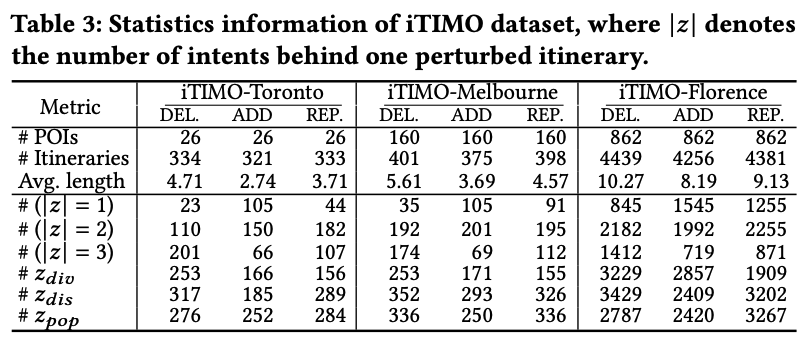

<p align="center">
  
</p>

# 🍄 iTIMO: An LLM-Empowered Synthesis Dataset for Travel Itinerary Modification

This repository provides the dataset and code for *iTIMO: An LLM-Empowered Synthesis Dataset for Travel Itinerary Modification*.

## 📄 Supplementary Material (Quick Link)

**[supplementary_material.pdf](supplementary_material.pdf)** — dataset details, additional analysis, and prompt examples.

## 📦 Dataset

The released benchmark dataset is under `Benchmark/iTIMO_dataset/`:
- `Benchmark/iTIMO_dataset/iTIMO-Florence/`
- `Benchmark/iTIMO_dataset/iTIMO-Melbourne/`
- `Benchmark/iTIMO_dataset/iTIMO-Toronto/`

### 🔁 Perturbation vs. Modification (Important)

In filenames like `Benchmark/iTIMO_dataset/iTIMO-Florence/Florence_ADD_test.json`, the `ADD/DELETE/REPLACE` token refers to the **perturbation** operation used to create the need-to-modify itinerary. The **modification** operation is the *inverse*:
- `*_ADD_*.json` → modify with **DELETE** (gold label field: `removed_index`)
- `*_DELETE_*.json` → modify with **ADD** (gold label fields: `insert_index`, `selected_poi`, `selected_cand_id`)
- `*_REPLACE_*.json` → modify with **REPLACE** (gold label fields: `replaced_index`, `selected_poi`, `selected_cand_id`)

### 🧾 File Naming and Format

- Naming: `<City>_<PerturbOp>_<split>.json` (e.g., `Florence_ADD_test.json`)
- Each file is a JSON dict: `{ "<sid>": sample, ... }`
- `sample["example_input"]` includes:
  - `need_to_modify itinerary`: `[[name, category, lon, lat, popularity], ...]`
  - `hint`: natural-language constraints for axes (popularity / category / spatial)
  - `threshold_low`, `threshold_high`: spatial thresholds (km)
  - `Candidate POIs`: present in `*_DELETE_*.json` and `*_REPLACE_*.json` (needed for ADD/REPLACE modification); typically absent in `*_ADD_*.json`

### 📊 Dataset Size (#samples)

The dataset statistics are provided in the paper (Table 2):

<p align="center">
  
</p>

## 🧭 Project Structure

This repo has two main parts:
- Data construction & perturbation: [DatasetPipeline/README.md](DatasetPipeline/README.md)
- Benchmark & evaluation: [Benchmark/README.md](Benchmark/README.md)

## 🛠️ Installation

Recommended Python `>=3.10`.

```bash
pip install -r requirements.txt
```

Note: running `DatasetPipeline/V31FM_perturbation.py` / `DatasetPipeline/baseline_perturbation.py` / `Benchmark/Prompting_LLM.py` requires access to the corresponding APIs (DeepSeek / Azure OpenAI / OpenAI, etc.).

## 🧪 Data Construction (Perturbation + Examples)

See [DatasetPipeline/README.md](DatasetPipeline/README.md) for perturbation and dataset construction steps.

## 📈 Benchmark & Evaluation

See [Benchmark/README.md](Benchmark/README.md) for evaluation, inference, parsing, and fine-tuning.

## 🗂️ Repository Layout (What Each Part Does)

```text
iTIMO/
├── DatasetPipeline/
│   ├── V31FM_perturbation.py — main perturbation generator (LLM + tool-calling + optional memory)
│   ├── baseline_perturbation.py — baseline perturbation generator
│   ├── position_POI_extraction.py — diff detector between original and perturbed itineraries
│   ├── data_cons.py — data construction utilities shared across RAG scripts
│   ├── dataset.py — prompt dataset loader for perturbation outputs
│   ├── data_split.py — generate train/val/test CSV splits (7:1:2)
│   ├── RAG_build_emd.py — RAG data construction with embedding neighbors
│   ├── RAG_build_hint.py — RAG data construction with hint neighbors
│   └── template/
│       ├── prompts.py — prompts for V31FM_perturbation.py
│       ├── baseline_prompts.py — prompts for baseline_perturbation.py
│       ├── functions.py — tool JSON schemas for tool-calling
│       └── CaseStudy.py — small demo/case-study helpers
├── Benchmark/
│   ├── Prompting_LLM.py — prompt-based itinerary modification runner (Azure/OpenAI/DeepSeek/LM Studio)
│   ├── process_pred.py — parse model outputs
│   ├── eval.py — compute accuracy + hint metrics
│   ├── hint_satis_check.py — per-sample hint satisfaction checker
│   ├── benchmark_prompts.py — prompt templates for modification tasks
│   ├── fine_tune_full.py — full-parameter SFT runner
│   ├── fine_tune_lora.py — LoRA/QLoRA SFT runner
│   ├── api_key/api_key.py — API key placeholders
│   └── iTIMO_dataset/ — released benchmark splits (train/val/test for each city/op)
├── data4perturb/ — Florence LearNext CSVs used by perturbation scripts
├── og_dataset/ — raw trajectory/POI datasets (CIKM’16, IJCAI’15)
├── figures/ — images used in README
└── requirements.txt — Python dependencies
```
